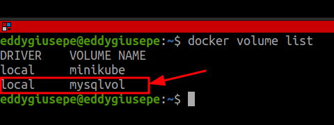
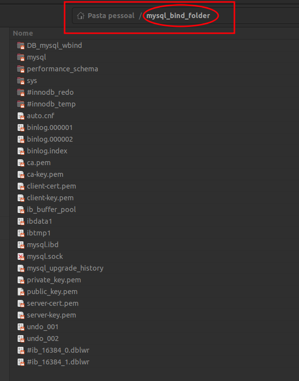

<h1 align="center"><font color="pink">Como salvar permanentemente o banco de dados dentro do Docker</font></h1>


<font color="yellow">Data Scientist.: Dr. Eddy Giusepe Chirinos Isidro</font>


# <font color="gree">Contextualizando</font>
Por padrão, o Docker não mantém os dados criados por você dentro de um contêiner. Se você parar o contêiner ou iniciar ele, os dados no seu banco de dados ainda estarão lá. Mas se você remover um contêiner ou quiser recriá-lo, os dados desaparecerão.

<font color="red">E se você quiser manter os dados?</font> 

Felizmente, isso pode ser feito. No `Docker`, existem dois métodos para manter os dados de forma mais permanente.  

# <font color="gree">Volume ou Bind Mount</font>
O primeiro é chamado de `volume` e o segundo é chamado de `montagem vinculada`. 

Então, quais são as diferenças. 

* Um `volume` no Docker é essencialmente um diretório dentro do Docker. Ele pode ser acessado por contêineres e é mantido quando você remove um contêiner.

* Uma `montagem vinculada` no Docker é onde você vincula um diretório dentro do Docker a um diretório em sua máquina host, também conhecido como fora do Docker ou em seu computador.

<font color="red">Pré-requisitos:</font> 

* Docker em teu computador

* Imagem Docker com Database

Aqui, usaremos uma imagem `MySQL`, mas os conceitos funcionarão com qualquer imagem de banco de dados que você queira usar.

# <font color="gree">Vamos na prática</font>

## <font color="pink">Primeira maneira: `Criando um Volume`</font>

Começamos criando um volume:
```
docker volume create mysqlvol 
```
Você pode verificar a criação do volume usando os seguintes comandos: `docker volume ls` ou `docker volume list`.

Usando `MySQL`, assim:

* Sem usar o volume:
```
docker run -d --name mysql-wvol -p 3306:3306 -e MYSQL_ROOT_PASSWORD=123456 -e MYSQL_DATABASE=multiple_regression mysql:latest
```

* Usando o volume:
```
docker run -d --name mysql-wvol -p 3306:3306 -e MYSQL_ROOT_PASSWORD=123456 -e MYSQL_DATABASE=multiple_regression --mount source=mysqlvol,target=/var/lib/mysql mysql:latest
```

Logo, você pode parar seu contêiner, assim: `docker stop mysql-wvol` e seguidamente eliminar ele, assim: `docker rm mysql-wvol`. E se você executar o seguinte comando: `docker volume list`, você verá ainda o volume criando anteriormente (`mysqlvol`):




Agora podemos criar outro contêiner que use esse mesmo volume, assim:
```
docker run -d --name mysql-wvol2 -p 3306:3306 -e MYSQL_ROOT_PASSWORD=123456 -e MYSQL_DATABASE=multiple_regression --mount source=mysqlvol,target=/var/lib/mysql mysql:latest
```
Esse novo contêiner contém os dados ainda, ou seja, o `Banco de Dados` foi armazenadono `volume` e mantido quando o contêiner foi removido. Isso mostra que os dados são mantidos em contêineres diferentes. `Então, é assim que você pode usar um volume para armazenar dados no Docker`  


## <font color="pink">Segunda maneira: `Criando um Volume`</font>
É armazenar os dados permanentemente usando uma `Montagem vinculada`. Uma montagem vinculada usa uma `pasta no seu computador` que é referenciada no contêiner do Docker.

* Vamos começar configurando uma pasta em nosso computador. Vou criar uma pasta chamada `mysql_bind_folder`. Essa pasta foi criada na minha `Pasta pessoal`

* Agora, podemos criar um novo contêiner usando o comando `docker run`, assim:

```
docker run -d --name mysql-wbind -p 3306:3306 -e MYSQL_ROOT_PASSWORD=123456 -e MYSQL_DATABASE=DB_mysql_wbind --mount type=bind,source="$(pwd)"/mysql_bind_folder,target=/var/lib/mysql mysql:latest
```

Você pode ver que o Docker criou vários arquivos na pasta `mysql_bind_folder`:



Nós não fazemos nada com os arquivos criados dentro da pasta (`mysql_bind_folder`), mas é interessante saber que foi criado pelo Docker.

Podemos eliminar o contêiner e criar outro para usar o mesmo volume, assim:

```
docker run -d --name mysql-wbind2 -p 3306:3306 -e MYSQL_ROOT_PASSWORD=123456 -e MYSQL_DATABASE=DB_mysql_wbind --mount type=bind,source="$(pwd)"/mysql_bind_folder,target=/var/lib/mysql mysql:latest
```
Podemos observar que os dados foram salvos em arquivos em nosso computador host ou em um computador fora do Docker.


`OBSERVAÇÃO:`

* De acordo com a documentação do `Docker`, eles recomendam o uso de `volume` em vez de `Montagem vinculada` 


Thanks God 🤗!