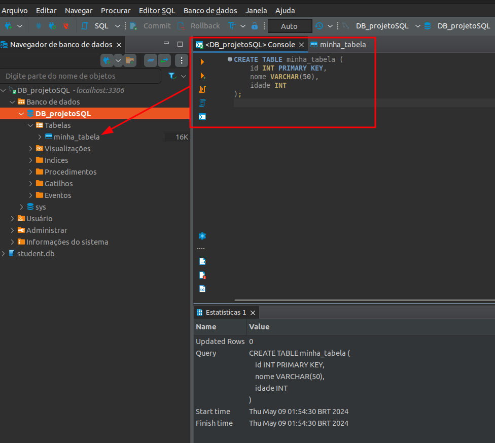
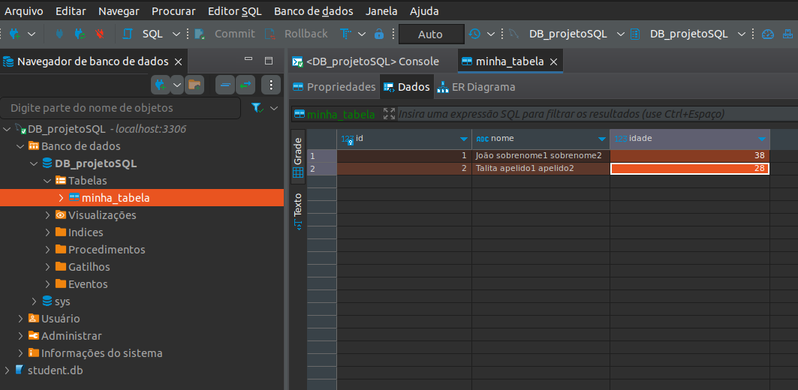
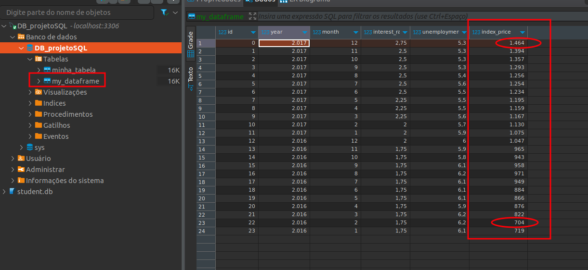

<h1 align="center"><font color="pink">Projeto End-to-End usando Python, MySQL e Docker</font></h1>


<font color="yellow">Data Scientist.: Dr. Eddy Giusepe Chirinos Isidro</font>


# <font color="gree">`1.` Criamos um contêiner MySQL</font>

Depois de instalar o `MySQL` e o `Docker`, executamos no terminal o seguinte comando para baixar e executar um `contêiner MySQL`, assim:
```
docker run -d --name container_mysql -p 3306:3306 -e MYSQL_ROOT_PASSWORD=123456 -e MYSQL_DATABASE=DB_projetoSQL mysql:latest
```

# <font color="gree">`2.` Conectar-se ao MySQL</font>

Aqui nos conectamos ao DB `MySQL`, para isso inserimos a senha e o Banco de Dados no `DBeaver` (obviamente o contêiner tem que estar em execução). 


# <font color="gree">`3.` Criamos uma Tabela</font>
Usando o console do DBeaver e a linguagem SQL criamos a tabela, assim:
```
CREATE TABLE minha_tabela (
    id INT PRIMARY KEY,
    nome VARCHAR(50),
    idade INT
);
```
A seguir a imagem de como foi criado a Tabela.



Vamos adicionar alguns dados a nossa Tabela, lá pela interface mesma do `DBeaver`.




# <font color="gree">`4.` Conectar Python ao MySQL</font>
Nesta parte podemos usar um script python (` 2_Encapsulamento_python_com_MySQL.py`), para nos 
conectar com o nosso Banco de Dados `MySQL`. Dessa maneira podemos realizar `queries` em nosso DB, `inserir` dados a nosso
DB, `deletar` dados de nosso DB, etc.


<font color="red">Exemplo de query</font>

Podemos realizar uma query a nossa Tabela `my_datafrae`, especificamente na coluna `index_price`, para trazer o valor `mínimo` e `máximo` dessa coluna. A query seria a seguinte:
```
SELECT MIN(index_price) AS minimo, MAX(index_price) AS maximo
FROM my_dataframe;
```

e o resultado seria:




Thanks God 🤓!