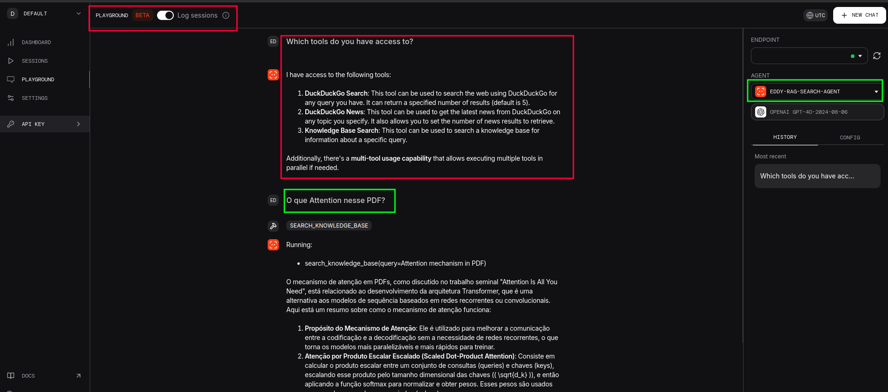

# <h1 align="center">🗃️ Agente AI RAG com acesso à Web</h1>

Senior Data Science.: Dr. Eddy Giusepe Chirinos Isidro

Notebook baseado no tutorial de [Shubham Saboo - awesome-llm-apps](https://github.com/Shubhamsaboo/awesome-llm-apps)

Este script demonstra como construir um agente `Retrieval-Augmented Generation` (`RAG`) com acesso à web usando `gpt-4o-2024-08-06` em poucas linhas de código `Python`. O agente usa uma `base de conhecimento` em `PDF` e tem a capacidade de `pesquisar na web` usando `DuckDuckGo`.

A interface gráfica é similar a:

## Características

* Cria um agente `RAG` usando `gpt-4o-2024-08-06`

* Incorpora uma `base de conhecimento` baseada em `PDF`

* Usa `LanceDB` como banco de dados vetorial para `pesquisa de similaridade` eficiente

* Inclui capacidade de `pesquisa na web` através do `DuckDuckGo`

* Fornece uma interface de playground para fácil interação

## Como funciona?

* `Criação de base de conhecimento:` o script cria uma base de conhecimento a partir de um arquivo `PDF` hospedado online.

* `Configuração do banco de dados vetorial:` o `LanceDB` é usado como banco de dados vetorial para pesquisa de similaridade eficiente dentro da base de conhecimento.

* `Configuração do agente:` um agente de IA é criado usando o `gpt-4o-2024-08-06` como modelo subjacente, com a base de conhecimento em `PDF` e a ferramenta de pesquisa `DuckDuckGo`.

* `Configuração do playground:` uma interface de playground é configurada para facilitar a interação com o agente `RAG`.

Thanks God!